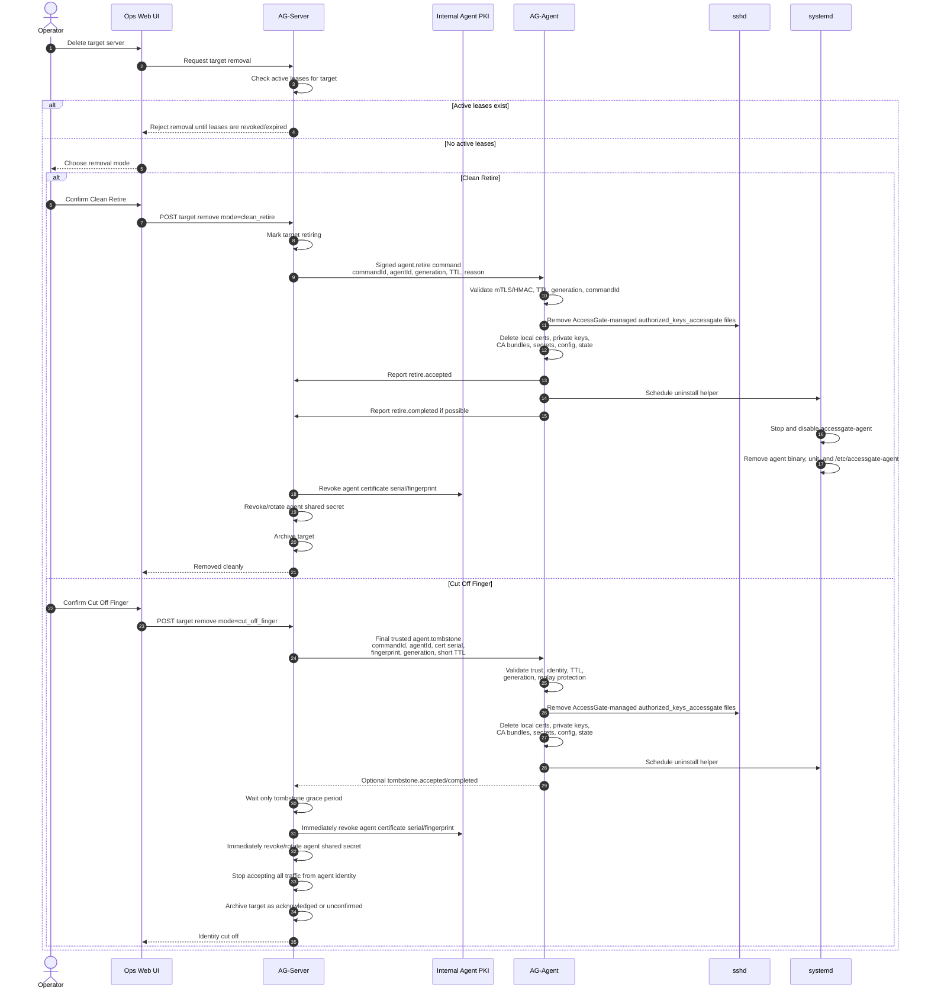

# Workflow: AG-Agent Clean Retire vs Cut Off Finger

This workflow describes the two supported removal paths for a managed target server.

`clean_retire` is cooperative. The AG-Agent is still trusted long enough to remove AccessGate-managed keys and uninstall itself.

`cut_off_finger` is immediate revocation. AccessGate revokes the agent identity locally and does not wait for the remote host.

## Diagram

## Notes

- `clean_retire` is preferred when the agent is reachable and not suspected compromised.
- `cut_off_finger` is preferred when the agent is compromised, unreachable, or no longer trusted.
- In `clean_retire`, certificate revocation happens after retire completion or timeout.
- In `cut_off_finger`, `agent.tombstone` is the final trusted command before revocation.
- `agent.tombstone` must be short-lived, replay-protected, and bound to the current certificate serial/fingerprint and generation.
- AccessGate waits only a very short tombstone grace period, then revokes locally regardless of acknowledgement.
- The AG-Agent self-uninstall helper must remove only AccessGate-owned files, including dead certificates, private keys, CA bundles, secrets, config, and state.
- From AccessGate's perspective, a cut-off agent is dead even if the process still exists on the remote host.
