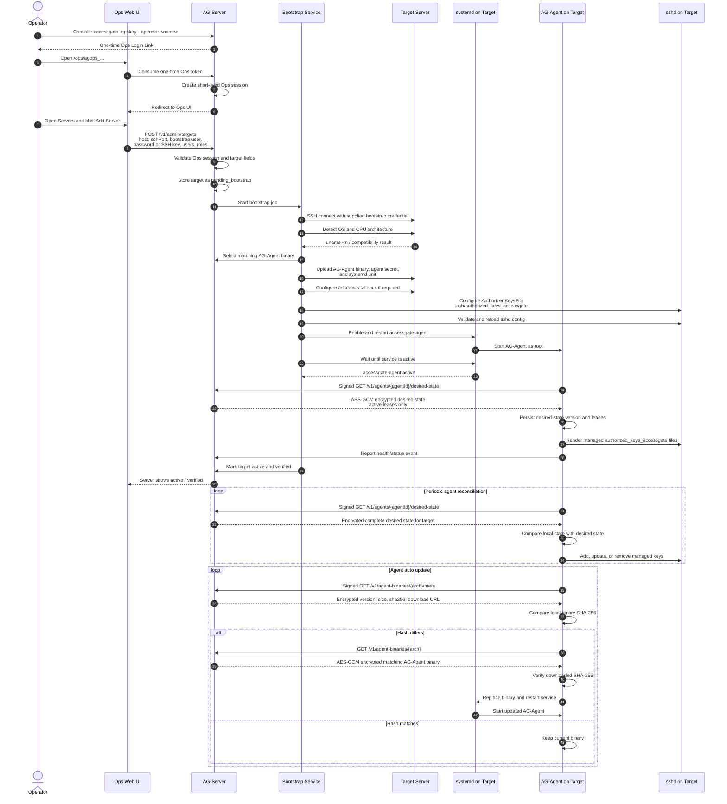

# Workflow: AG-Agent Rollout, Validation, and Communication

This workflow describes how AccessGate adds a new managed server, installs the AG-Agent, validates the installation, and keeps the agent synchronized through desired-state communication.

## Diagram

## Notes

- The operator is the trust anchor for adding a new target server.
- Bootstrap credentials are used only for the install session and must not be persisted.
- Bootstrap should support both password and SSH-key authentication.
- The AG-Server selects the correct AG-Agent binary by detected target architecture.
- A target is marked active only after the AG-Agent service is installed, started, and verified.
- The AG-Agent owns only AccessGate-managed key files such as `authorized_keys_accessgate`.
- Desired state is the source of truth. The AG-Agent converges local state to the complete desired-state document instead of trusting one-off mutation commands.
- Expired and revoked leases are omitted from desired state, so the AG-Agent removes their managed keys.
- The agent auto-updater treats SHA-256 as the update authority. The version string is informational.
- AG-Agent communication uses per-agent shared secrets, HMAC-signed requests, timestamp validation, and AES-GCM encrypted envelopes for desired state, update metadata, and agent binaries.
- Requester API keys are not the AG-Agent trust channel.
- mTLS can still be added later as an additional transport identity layer.
