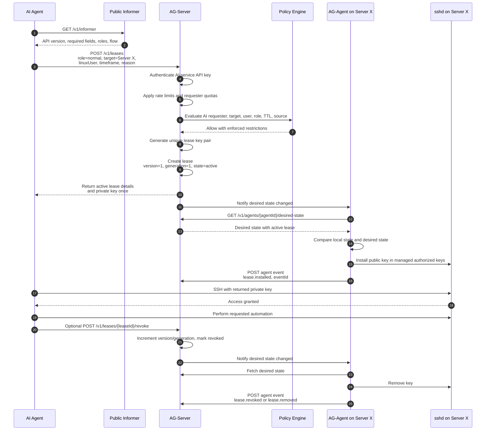

# Workflow: AI Agent Requests Access to Server X

This workflow describes an AI agent, such as Codex or another automation service, requesting temporary normal access to `Server X`.

## Diagram

## Notes

- The AI agent can discover the correct process through the Public Informer.
- Normal access remains short-lived and policy-controlled.
- AccessGate generates lease key pairs and returns private keys exactly once.
- Rate limits and active lease quotas protect against broken automation loops.
- The AI should revoke the lease early when work is complete.
- If the AI does not revoke, the AG-Agent removes the key when the TTL expires.
