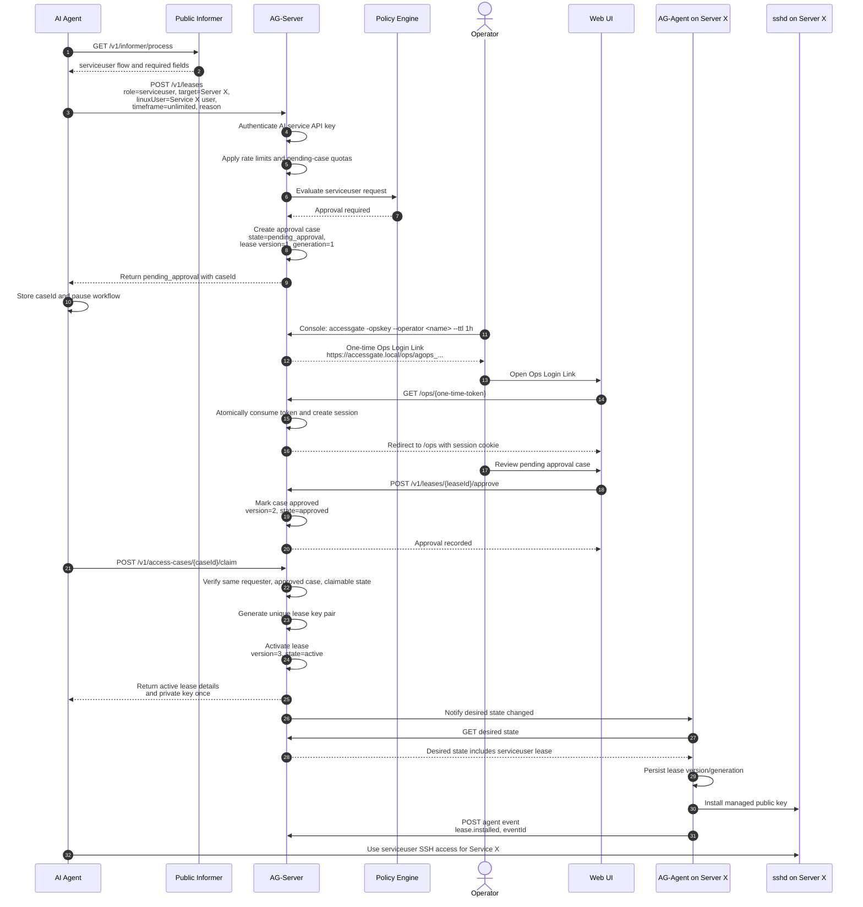

# Workflow: AI Agent Requests Serviceuser Access for Service X

This workflow describes an AI agent requesting long-running or unlimited `serviceuser` access for `Service X`. Unlimited serviceuser access requires human approval and a second claim call.

## Diagram

## Notes

- Unlimited serviceuser access never auto-activates.
- The first AI request returns `pending_approval` and `caseId`.
- The human operator uses an Ops Login Link to access the Web UI.
- The Ops Login Link is one-time use and then replaced by an operator session.
- Approval only changes the case to approved. The AI must claim the case to activate the lease.
- AccessGate generates the serviceuser lease key pair only during successful claim.
- Private key material is returned only once during the claim response.
