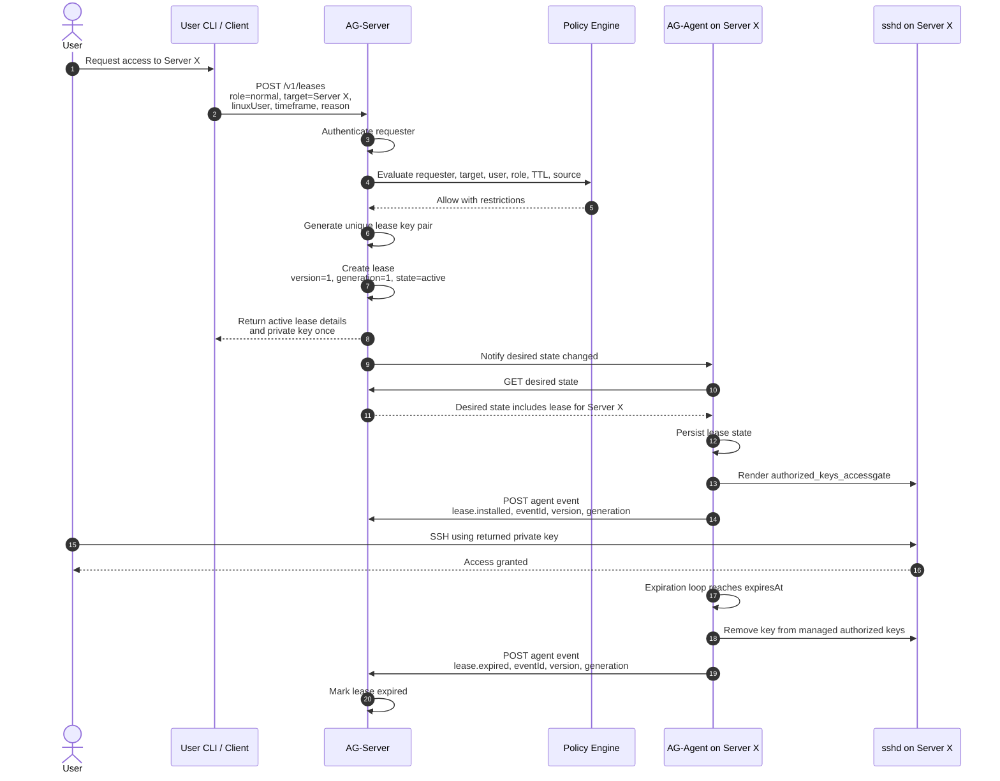

# Workflow: User Requests Access to Server X

This workflow describes a human user requesting temporary normal access to `Server X`.

## Diagram

## Notes

- Normal user access is capped at 1 hour.
- AccessGate generates the SSH key pair for the lease.
- The generated private key is returned exactly once.
- If private-key delivery is lost, the lease must be revoked and requested again.
- AG-Agent applies desired state and does not blindly trust mutation commands.
- Expiration is enforced locally by the AG-Agent even if AG-Server is unavailable.
